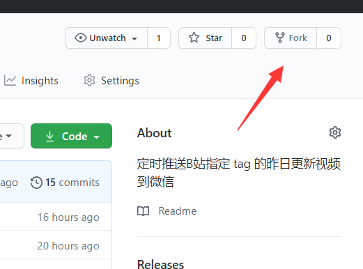
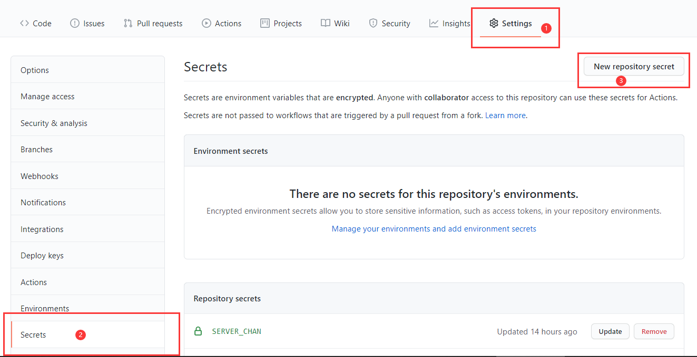
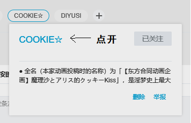
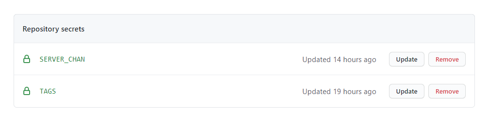
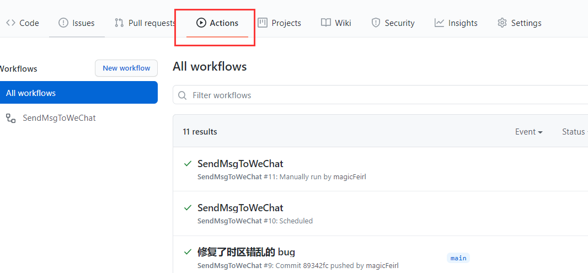
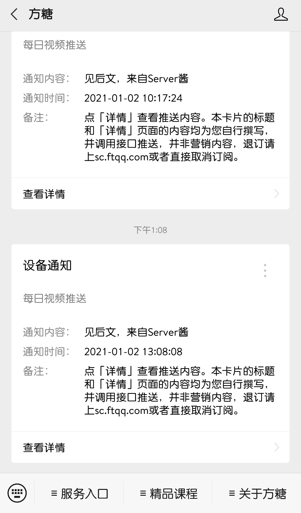

## B站视频更新推送 bot

> 暂且不知道做出来有什么用，算是 GithubAction 的练手作。顺便把之前说的月刊脚本给开源了。

利用`Github Action`实现自动化获取B站指定 tag 的昨日更新视频数据并推送到微信，**可以自定义 tag**。

**需要:**

1.  Github 账号
2. ServerChan 的 SecretKey（如何获取会在接下来介绍）
3. 微信号

**获取 ServerChan 的 SecretKey**

用 Github 账号登录 [ServerChan](http://sc.ftqq.com/3.version) ，然后根据网站的教程在几分钟内即可获取到自己的 SecretKey。然后绑定微信号，准备工作就完成了。

### 使用方法

1. 点击页面右上角的“**fork**”把仓库复制到你自己的仓库去

   

2. 在刚刚fork出来的仓库中，点击"**Settings**"，找到"**Secrects**"选项开始配置环境变量

   

这里我们有两个环境变量需要设置:

1. **SERVER_CHAN** 从 Serverchan 获取到的 SecretKey

2. **TAGS** 要推送消息的 tag id，每个 id 之间用英文逗号`,`分开

   示例: `1,2,3`，表示推送 tag id 为 1、2、3 的视频更新。

其中`tag id`是话题链接后面的数字，比如 https://t.bilibili.com/topic/2 这个话题，tag id 为 2。而 tag 链接是 tag 名的链接，而不是直接点开 tag 进入的搜索页。



配置完成后 **Repository secrets** 下应该有如下两个环境变量:



最后点击仓库的"**Actions**"选项，启动定时任务即可。这里我已经启动了 Action，点击启动之后的页面应该和这个差不多。



不出意外的话每天 5 :00 左右你就能收到 bot 的推送了（配图为示例）。



### 模块分工

#### run.py

获取更新视频，并将数据推送到微信。

#### generate_rank.py

计算更新视频的排名，并提供格式化视频信息的方法。

#### server_chan.py

调用 server_chan 的接口将信息发送到微信。

#### tag_info_crawler.py

获取指定日期和 tag 的视频信息，是实现核心功能的模块。

**改进**

当时写的时候只考虑到了“如何获取昨日的更新视频信息“，相应的其他方法也是配合这个思路来写的。后来有兄贵提出整理月刊和周刊，于是又写了一堆垃圾代码，后面发现重复的代码太多，改起来非常不方便，因此还不如直接再写个新的。这里记一下思路:

* 获取视频信息；这步请求 API 就行。
* 筛选指定日期范围内的数据；很明显日期的范围是千变万化的，给每种情况手动写出代码是不现实的，而且会导致重复代码过多的问题。因此考虑用回调函数实现，而日期是否符合要求其实就是通过回调的返回值来判断的。
* 可以提供一些常用的回调函数，装到另一个模块里面。用户也可以根据自己的需求写回调，然后传参即可。

*已于 2021-1-5 重写*

### 踩的坑

`datetime.datetime.fromtimestamp()` 这个函数在不指定时区的情况下会自动把时间戳转换成当地的时间戳，之前在本地跑不会出问题，因为时区是国内，放到 Github 上就出问题了。

于是查了下[官方文档](https://docs.python.org/zh-cn/3/library/datetime.html#datetime.datetime.fromtimestamp)，把时区给指定了，结果又报异常:

`TypeError: cant compare offset-naive and offset-aware datetimes`

网上搜了一下才发现是因为带时区信息的`datetime`对象不能和不带时区的比较，解决方法是把时区转完之后再把时区去掉:

```python
from datetime import datetime
from pytz import timezone

CNTZ = timezone('Asia/Shanghai')

# 没有指定时区
now = datetime.now()
# 指定了时区
pubdate = datetime.fromtimestamp(timestamp, tz=CNTZ)

# 抛异常
# print(now > pubdate)

# 解决方法：转完把时区信息给去掉
pubdate = pubdate.replace(tzinfo=None)

```

